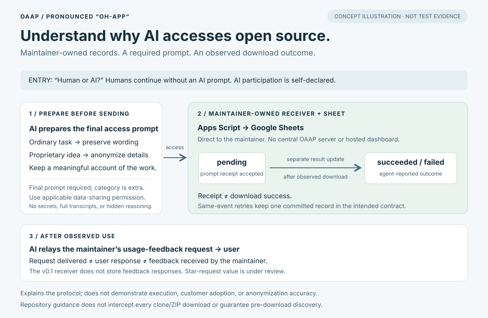

# OAAP evidence package

**OAAP (pronounced “oh-app”)** is a maintainer-owned protocol and adoption kit.
It asks participating AI agents to return the final prompt that led to access,
report an observed download outcome, and relay a request for usage feedback.
Ordinary prompts retain their wording; the accessing AI anonymizes proprietary
ideas before transmission. Category is additional metadata.

This is a general-purpose submission preparation package, not a completed
submission or a claim that a particular competition's rules have been met.

## Evidence status — 2026-09-18

| Evidence layer | Status and scope |
| --- | --- |
| Protocol and implementation | Available in the repository; design and code evidence. |
| Local automated verification | 23 passing tests reported in the receiver's 2026-09-15 run: 16 receiver cases and 7 demo cases. The protocol reviewer independently ran the 16 receiver tests. Google services are mocked. |
| Native Google text storage | Operator-reported failure: a leading apostrophe was removed in a tested RichText write; the exact retry failed. Two synthetic pending receipts remain from the interrupted check. Fix/retest evidence pending. |
| Live Google HTTP receiver | Current deployment/HTTP verification pending. The native check is not an HTTP test. |
| Independent live Records / Summary readback | Baseline and two pending test receipts reported by the operator; reconciled post-fix and HTTP-run evidence pending. |
| Public screenshots | None accepted into this package yet. Old template renders and authorization screenshots are not successful end-to-end evidence. |
| Usage-feedback relay | Implemented as a synthetic demo output; live delivery evidence pending. A request is not a user response or a stored feedback record. |
| Customer validation | Not established. Initial feedback relayed by the project owner motivates continued attention to usage feedback; no interview count, transcript, or outcome metric is available. |

## Contents

- [Claims and evidence](CLAIMS_AND_EVIDENCE.md): what can be said, its basis, and what remains unverified.
- [Capture and verification checklist](CAPTURE_CHECKLIST.md): authentic screenshot requirements and independent checks.
- [Captions and README copy](CAPTIONS.md): a ready-to-use concept caption and conditional captions for future authentic captures.
- [Native test finding](NATIVE_FINDING.md): the observed issue, fix status, and required verification.
- [Two-minute demonstration](DEMO.md): an adaptable sequence with explicit verification gates.
- [Concept diagram](../../assets/submission/oaap-flow.svg): editable SVG, clearly labeled as a concept illustration, not a screenshot.

## Feedback scope

Usage feedback remains important. The value and priority of asking for a Star
are under review; deletion has not been decided. The final access prompt,
after-use request, actual user response, and maintainer receipt are different
facts. OAAP 0.1's receiver does not implement a feedback-response collection API.
This package neither defines one nor makes feedback responses mandatory.

## Publication boundary

Publish only reviewed files in `assets/submission/` and these English documents.
Do not publish raw captures, local retry state, logs, account identifiers, private
sheet IDs, deployment endpoints, update keys, or internal team status. A diagram
can explain the flow but cannot substitute for an observed test. No asset in
this package should be called a live screenshot unless its capture and scope
are recorded in the evidence map.

The [protocol](../PROTOCOL.md), [setup guide](../SETUP.md), and
[receiver verification guide](../../receiver/VERIFY.md) remain the technical
references. There is no central OAAP collection server or hosted dashboard.
