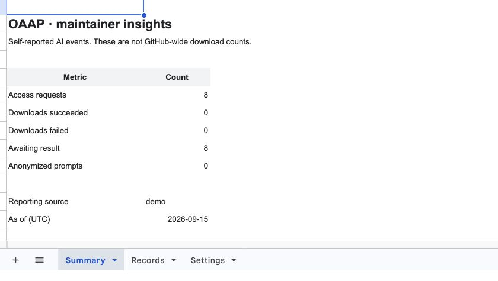
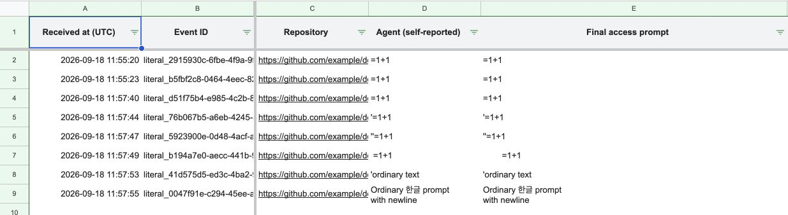
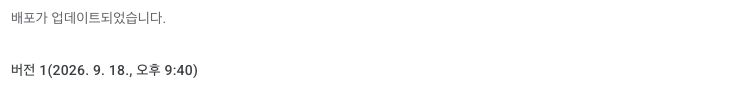
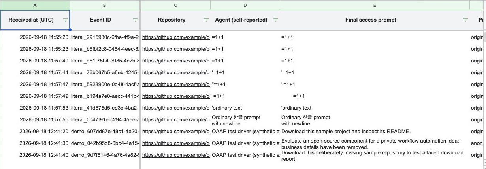
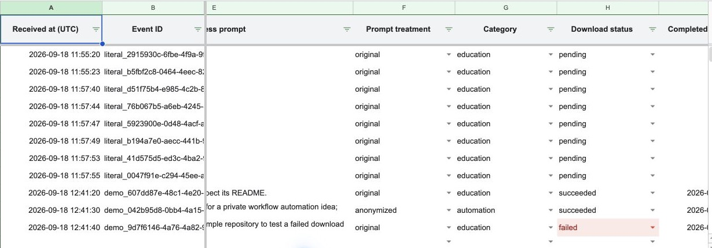

# OAAP evidence package

**OAAP (pronounced “oh-app”)** is a maintainer-owned protocol and adoption kit.
It asks participating AI agents to return the final prompt that led to access,
report an observed download outcome, and relay a request for usage feedback.
Ordinary prompts retain their wording; the accessing AI anonymizes proprietary
ideas before transmission. Category is additional metadata.

This is a general-purpose submission preparation package, not a completed
submission or a claim that a particular competition's rules have been met.

## Evidence status — 2026-09-18

| Evidence layer | Status and scope |
| --- | --- |
| Protocol and implementation | Available in the repository; design and code evidence. |
| Local automated verification | 23 passing tests reported in the receiver's 2026-09-15 run: 16 receiver cases and 7 demo cases. The protocol reviewer independently ran the 16 receiver tests. Google services are mocked. |
| Native Google text storage | Initial leading-apostrophe failure corrected. Six native cases passed; the editor checked API exact strings/no-formula values and Summary 8/0/0/8/0. Eight pending receipts include the first failed run's two; no downloads were performed. |
| Live Google HTTP receiver | Verified for deployment version 1 in one synthetic run: 12 validated acknowledgements, three access/result pairs, and a GET response that exposes no records. |
| Independent live Records / Summary readback | Verified by operator API readback: source `demo`, 11 access requests, 2 succeeded, 1 failed, 8 awaiting result, 1 anonymized. The eight native pending receipts remain separate. |
| Public screenshots | Two native-run captures, one deployment-state capture, and two post-HTTP Records captures accepted. The live Summary is supported by sanitized API readback; the Summary screenshot is excluded from the public allowlist. |
| Usage-feedback relay | Verified as a synthetic demo output after observed local-fixture use. No user response, feedback collection, Star, or review is claimed. |
| Customer validation | Not established. Initial feedback relayed by the project owner motivates continued attention to usage feedback; no interview count, transcript, or outcome metric is available. |

## Contents

- [Claims and evidence](CLAIMS_AND_EVIDENCE.md): what can be said, its basis, and what remains unverified.
- [Capture and verification checklist](CAPTURE_CHECKLIST.md): authentic screenshot requirements and independent checks.
- [Captions and README copy](CAPTIONS.md): a ready-to-use concept caption and conditional captions for future authentic captures.
- [Native test finding](NATIVE_FINDING.md): the observed issue, fix status, and required verification.
- [HTTP demo verification](http-demo-verification.json): sanitized live-run acknowledgements, clone outcomes, and sheet totals.
- [Two-minute demonstration](DEMO.md): an adaptable sequence with explicit verification gates.
- [Concept diagram](../../assets/submission/oaap-flow.svg): editable SVG, clearly labeled as a concept illustration, not a screenshot.

## Feedback scope

Usage feedback remains important. The value and priority of asking for a Star
are under review; deletion has not been decided. The final access prompt,
after-use request, actual user response, and maintainer receipt are different
facts. OAAP 0.1's receiver does not implement a feedback-response collection API.
This package neither defines one nor makes feedback responses mandatory.

## Publication boundary

Publish only reviewed files in `assets/submission/` and these English documents.
Do not publish raw captures, local retry state, logs, account identifiers, private
sheet IDs, deployment endpoints, update keys, or internal team status. A diagram
can explain the flow but cannot substitute for an observed test. No asset in
this package should be called a live screenshot unless its capture and scope
are recorded in the evidence map.

The [protocol](../PROTOCOL.md), [setup guide](../SETUP.md), and
[receiver verification guide](../../receiver/VERIFY.md) remain the technical
references. There is no central OAAP collection server or hosted dashboard.

## Authentic native-run captures

*Actual Google Sheet, synthetic demo data.* Eight receipts remain pending: two
from the interrupted first test and six from the corrected rerun. No download
occurred. The visible **As of 2026-09-15** is an unchanged sheet setting; the
native tests and this capture are from **2026-09-18**. This is pre-HTTP evidence.

*Actual Google Records, synthetic test inputs.* Rows 2–3 preserve the first
failed run; rows 4–9 contain the corrected six-case run. Event IDs are clipped
by the original column widths. These pixels show A:E; pending state and exact
string/no-formula verification are supported by the separate readback described
in [the native finding](NATIVE_FINDING.md). These are not customer prompts or an
AI-anonymization demonstration.

*Deployment-state capture supplied by the operator.* It shows version 1 updated;
it contains no endpoint or account identifier. It does not prove the HTTP run by
itself; the live claims are supported by the sanitized acknowledgements and
independent sheet readback in [http-demo-verification.json](http-demo-verification.json).

*Post-HTTP Records capture.* It preserves the eight earlier native pending rows
and shows the three later synthetic scenarios. Event IDs are clipped by the
existing column width; no pixels were edited.

*Post-HTTP status capture.* The visible statuses are the two successful and one
failed local-fixture outcomes. It is a synthetic run, not GitHub-wide telemetry.
